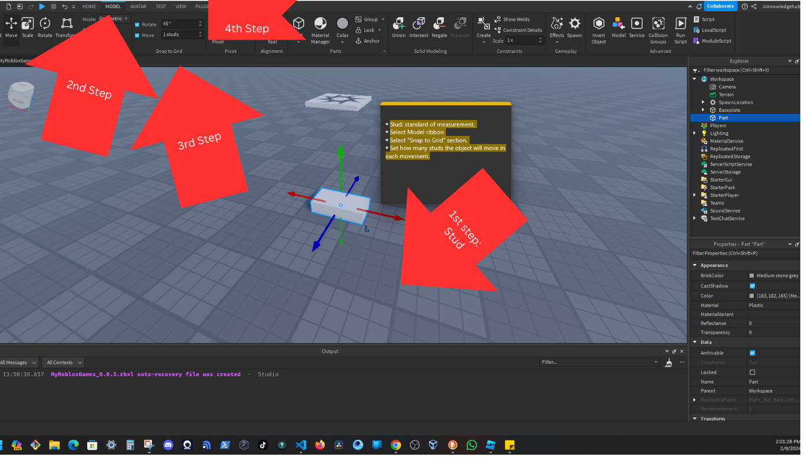

# Section 1: Learning to Use Studio.
## Roblox Account and install

## Studio Interface and Saving.
<table>
    <tr>
        <thead>
            <td>Folder Structure</td>
            <td></td> 
        </thead>
    </tr>
    <tr>
        <tbody>
            <td>MyRobloxGame</td>
            <td>
                <ul>
                    <li>Local</li>
                    <li>Models</li>
                </ul>
            </td>
        </tbody>
    </tr>
</table>

### First Screen

### Second Screen

### Workspace

### Explorer Window

### Associated Properties

### Ribbon Tab

### Save as 1st step

### Save as 2nd step

### Save as 3rd & 4th step

## Using the Camera.
### Left

### Right

### Forward

### Backwards

### Upward

### Downward

### Right button mouse

### Finding World Components.

### Component Specificity.

### Mouse Shorcut.

## Move, Scale and Rotate Parts.
### Camera Indicator.

### Show Orientation Indicator Option.

### Add Part

### Movement Selector.

### Stud.

### Scale Selector.

### Rotate Selector.

### Increment || Decrement Angle Rotation

### Appearance Properties.

## Creating Models.
### Insert from file

### Parts of a Model.

<table>
    <thead>
    </thead>
    <tbody>
    <tr>
        <td>Pomodoro  
        </td>
        <td>
          <ul>
            <li>1 - 2//2024</li>
            <li>2 - 2//2024</li>
            <li>3 - 2//2024</li>
            <li>4 - 2//2024</li>
          </ul>
      </td>
      </tr>
      <tr>
        <td>Pomodoro  
        </td>
        <td>
          <ul>
            <li>1 - 2/9/2024</li>
            <li>2 - 2/9/2024</li>
            <li>3 - 2/9/2024</li>
            <li>4 - 2/9/2024</li>
          </ul>
      </td>
      </tr>
    </tbody>
</table> 