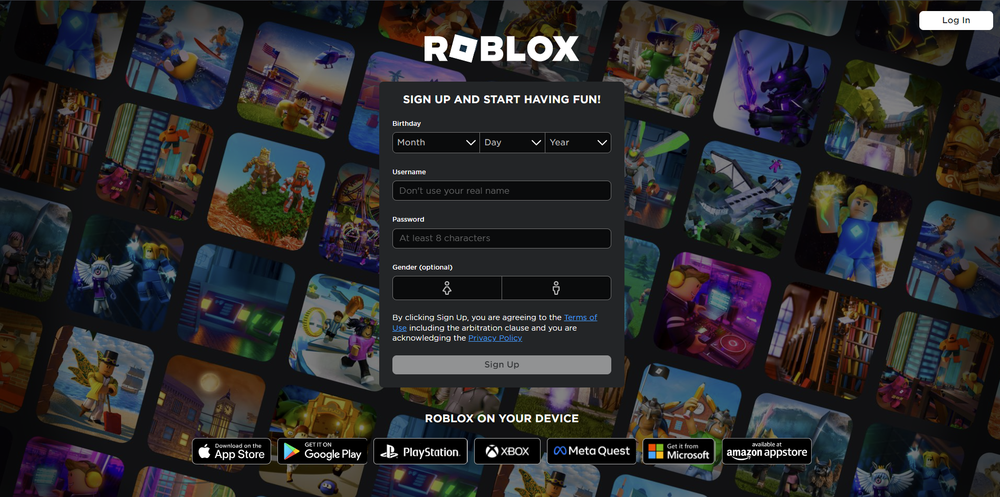
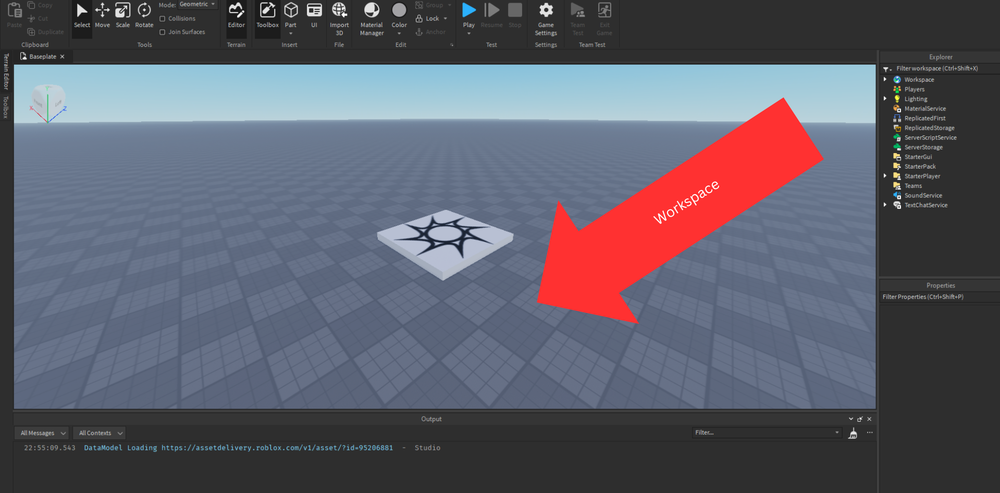

# Section 1: Learning to Use Studio.
## Roblox Account and install

## Studio Interface and Saving.
<table>
    <tr>
        <thead>
            <td>Folder Structure</td>
            <td></td> 
        </thead>
    </tr>
    <tr>
        <tbody>
            <td>MyRobloxGame</td>
            <td>
                <ul>
                    <li>Local</li>
                    <li>Models</li>
                </ul>
            </td>
        </tbody>
    </tr>
</table>

### First Screen

### Second Screen

### Workspace

### Explorer Window

### Associated Properties

### Ribbon Tab

